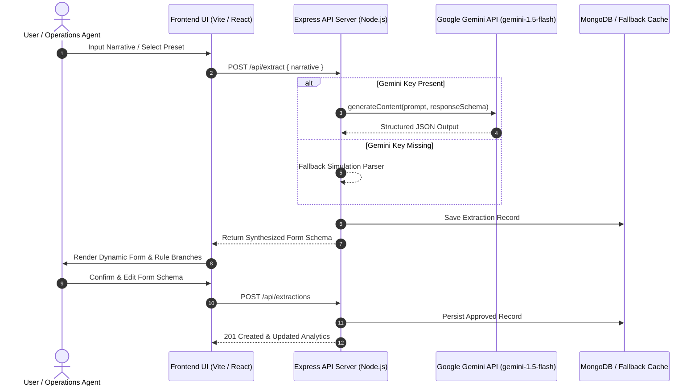

# Forma AI ⚡ Dynamic AI Claim Intake & Schema Parsing Engine

> **Forma AI** converts unstructured, real-world narrative text (e.g. incident reports, insurance claims, medical intake notes) into validated, structured JSON form schemas in real time powered by Google Gemini AI.

---

## 🌟 Key Capabilities

- 🤖 **Real-Time Gemini AI Engine**: Parses raw unstructured text narratives into structured form fields (`incidentType`, `location`, `description`, `urgency`).
- ⚡ **Dynamic Rule Branching**: Evaluates incoming narrative keywords to trigger secondary, context-aware intake questions (e.g. Auto Accidents trigger drivability checks; Fire incidents trigger housing assistance rules).
- 💾 **Dual-Layer Resilience**: Automatically persists claims to MongoDB when online, and seamlessly degrades to an in-memory fallback cache when offline without interrupting UX.
- 📊 **Analytics KPI Dashboard & Urgency Bar Charts**: Live aggregated statistics reporting total ingested claims, high-urgency alert counts, top incident categories, and visual proportional urgency distribution bar charts.
- 🔍 **Real-Time Search & Category Filtering**: Instant fuzzy text search across narratives, locations, and descriptions, paired with category dropdown filters and a **"🚨 High Urgency Only"** quick toggle.
- 📥 **CSV & JSON Data Exports**: Instant client-side generation and downloading of claims datasets in spreadsheet `.csv` and raw `.json` formats.
- ✍️ **Editable Schema Overrides**: Allows users to manually review, edit AI-extracted values, and confirm schema ingestion into the database.
- ☁️ **Cloud Deployment Ready**: Includes production `render.yaml` infrastructure blueprint, `vercel.json` SPA configuration, and multi-stage `Dockerfiles`.

---

## 🏗️ System Architecture



---

## 🔀 Rule Branching Matrix

Forma AI dynamically activates contextual intake fields based on incident categorization:

| Incident Category | Trigger Condition | Activated Branching Question |
| :--- | :--- | :--- |
| **Auto Accident** | Narrative mentions collision, collision damage, vehicle, deer | `"Is the vehicle drivable?"` |
| **Fire / Smoke Damage** | Narrative mentions fire, burn, heat damage, smoke | `"Requires temporary housing assistance?"` |
| **Clinical Consultation** | Narrative mentions clinic, medical, doctor, pain, surgery | `"Are you taking pain medication?"` |
| **Water Damage** | Narrative mentions pipe burst, water leak, flooding | `"Has water source been stopped and isolated?"` |
| **Theft / Burglary** | Narrative mentions stolen items, break-in, smash, robbery | `"Was a police report filed and documented?"` |
| **Liability / Injury** | Narrative mentions slip, fall, injury, wet floor | `"Did the incident occur on public property?"` |

---

## 📡 API Reference

### 1. `POST /api/extract`
Parses unstructured text narrative into a structured form schema.

### 2. `GET /api/extractions`
Retrieves history of processed and ingested claim extractions.

### 3. `POST /api/extractions`
Saves or overwrites a manually reviewed and confirmed claim schema into the database.

### 4. `GET /api/analytics`
Returns aggregated KPI statistics for dashboard presentation:
```json
{
  "totalExtractions": 12,
  "urgencyCounts": { "High": 4, "Medium": 5, "Low": 3 },
  "categoryCounts": { "Auto Accident": 5, "Water Damage": 4, "Liability/Injury": 3 },
  "topCategory": "Auto Accident"
}
```

### 5. `GET /api/health`
Returns backend health status and active Gemini API configuration state (`geminiActive`: `boolean`).

---

## ☁️ Cloud Deployment & Containerization

### 1. Backend (Render / Docker)
* **Render Blueprint**: Use the included `render.yaml` blueprint for automatic deployment on [Render](https://render.com).
* **Docker Container**: Build and run containerized backend:
  ```bash
  docker build -t forma-ai-backend ./backend
  docker run -p 5000:5000 forma-ai-backend
  ```

### 2. Frontend (Vercel / Docker)
* **Vercel Deployment**: Configured with `frontend/vercel.json` for single-page client routing rewrites.
* **Docker Container**: Multi-stage NGINX static web server build:
  ```bash
  docker build -t forma-ai-frontend ./frontend
  docker run -p 80:80 forma-ai-frontend
  ```

---

## 🚀 Local Quick Start Guide

### 1. Clone & Install Dependencies
```bash
git clone https://github.com/ASIM-05/forma-ai.git
cd forma-ai

# Install root dependencies
npm install

# Install backend dependencies
cd backend && npm install

# Install frontend dependencies
cd ../frontend && npm install
```

### 2. Configure Environment Variables
Copy `.env.example` in `backend/` to `.env`:
```env
MONGODB_URI=mongodb://127.0.0.1:27017/forma-ai
PORT=5000
GEMINI_API_KEY=your_gemini_api_key_here
```
*(Note: If `GEMINI_API_KEY` is omitted, the server automatically operates in high-fidelity mock simulation mode).*

### 3. Start Development Servers
From the root directory:
```bash
# Terminal 1: Start Backend Express Server
cd backend && npm run dev

# Terminal 2: Start Frontend Vite Dev Server
cd frontend && npm run dev
```

Navigate to `http://localhost:5173` to view the running app!

